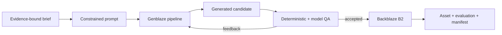

# ReproFrame AI

**Scientific visuals you can verify, not just admire.**

ReproFrame turns a bounded set of evidence-backed claims into a visual abstract and
keeps every prompt, attempt, quality check, revision, model decision, and asset hash in
one replayable manifest. It is being built for the Backblaze Generative Media
Hackathon using Genblaze for media orchestration and Backblaze B2 as the durable system
of record.

## Current state

The first foundation runs end to end in zero-credential fixture mode:

1. validate an evidence-bound visual brief;
2. construct a constrained generation prompt;
3. generate a real SVG candidate;
4. evaluate required labels, prohibited content, and integrity metadata;
5. persist the asset and reproducibility manifest;
6. expose both through a working FastAPI UI.

Fixture results remain explicitly labeled development proof. A credentialed
`gemini-svg` run has now generated a safe, self-contained scientific SVG through a
free-tier Gemini text model, passed the Genblaze evaluation loop with a 1.0 score, and
stored the candidate, Genblaze provenance, and final manifest in encrypted B2. The
private bucket is served through a narrow application proxy, so credentials and signed
URLs never enter manifests.

The GMI adapter is also authenticated and ready behind `REPROFRAME_MODE=gmi`, but the
account currently has no generation credits. `gemini-svg` is therefore the verified
real-mode path; it falls back between compatible free-tier text models on transient
provider failure.

## Run locally

Requirements: Python 3.11–3.13 and [uv](https://docs.astral.sh/uv/).

```bash
make setup
make test
make demo
make api
```

Open <http://127.0.0.1:8000>.

Copy `.env.example` to `.env` and set `REPROFRAME_MODE=gemini-svg`, `GEMINI_API_KEY`,
and the bucket-scoped B2 variables to run the credentialed cloud path. Keep
`REPROFRAME_MODE=fixture` for offline development and tests.

## Architecture



The local fixture implements the same control boundary with a local artifact store.
Cloud credentials are never accepted by the browser or written into manifests.

## Project plan

See [docs/PROJECT_PLAN.md](docs/PROJECT_PLAN.md) for milestones, safety boundaries, and
submission acceptance gates.

## Open-source use

ReproFrame depends on the official MIT-licensed
[Genblaze](https://github.com/backblaze-labs/genblaze) SDK. No Genblaze source is
copied into this repository. Backblaze B2 integration uses its documented
S3-compatible API.

## License

Apache-2.0.
